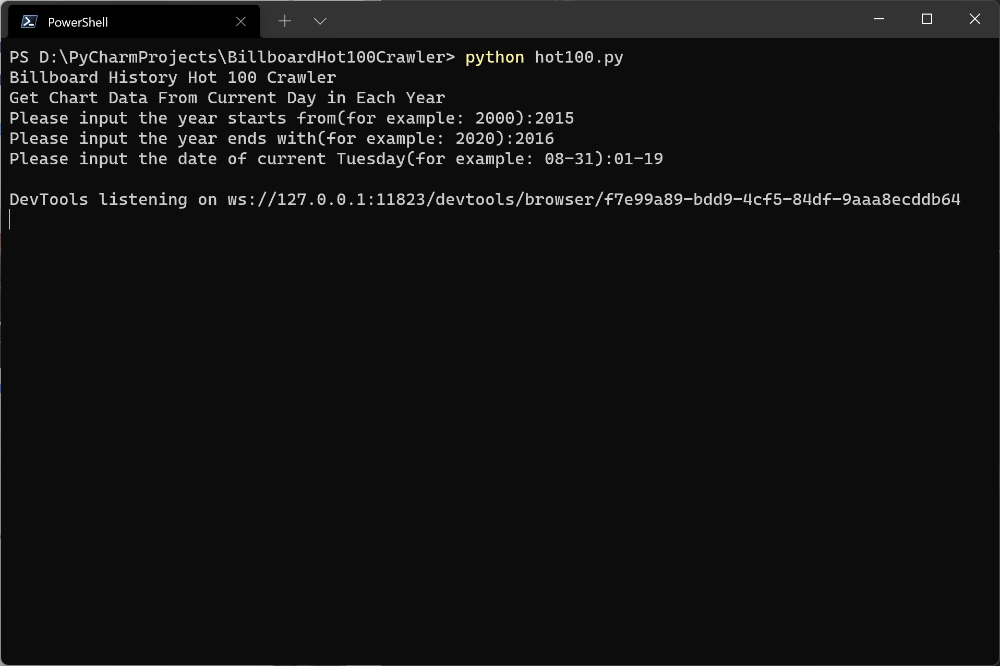

# Billboard Charts Crawler

### What is this?

This tool can help you to get the chart data from billboard for several years and save them into an Excel file.
To use this tool, you need to download the correct version of Chrome.
The given chromedriver.exe matches Chrome 93 on Windows.
To download other version of chromedriver, please click the link below:

[Chrome Drivers](http://npm.taobao.org/mirrors/chromedriver/)

### How to use?

**Currently, there is a tool only for Hot 100, but more charts will be supported later.**

Make sure you have installed python, then install the requirements.

`pip install -r requirements.txt`

Then run `hot100.py`

`python hot100.py`

### Notice

This is what the script running looks like:

The website may access slowly in some area, so be patient.

During access the website, the console may show some ssl errors. However, that won't influence the results.
